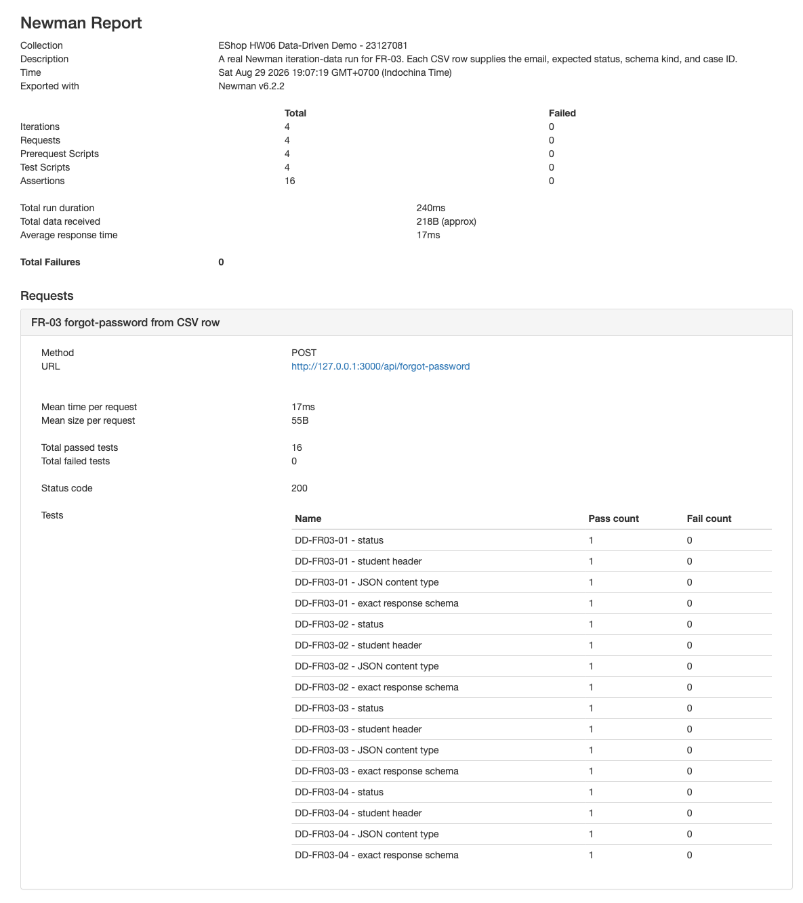
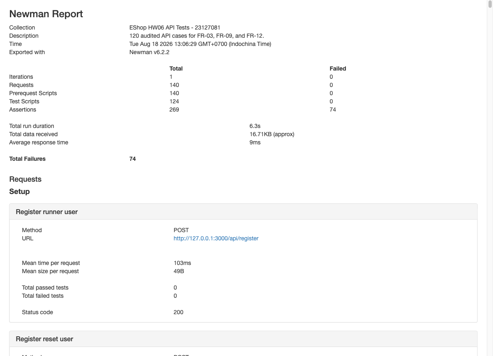
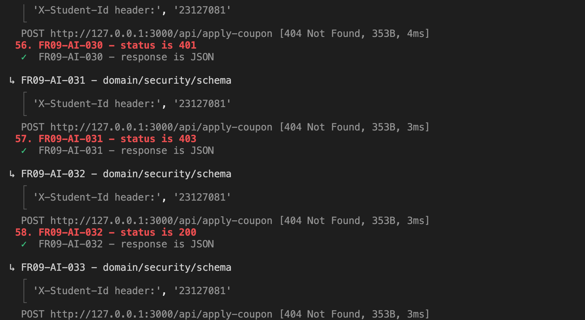
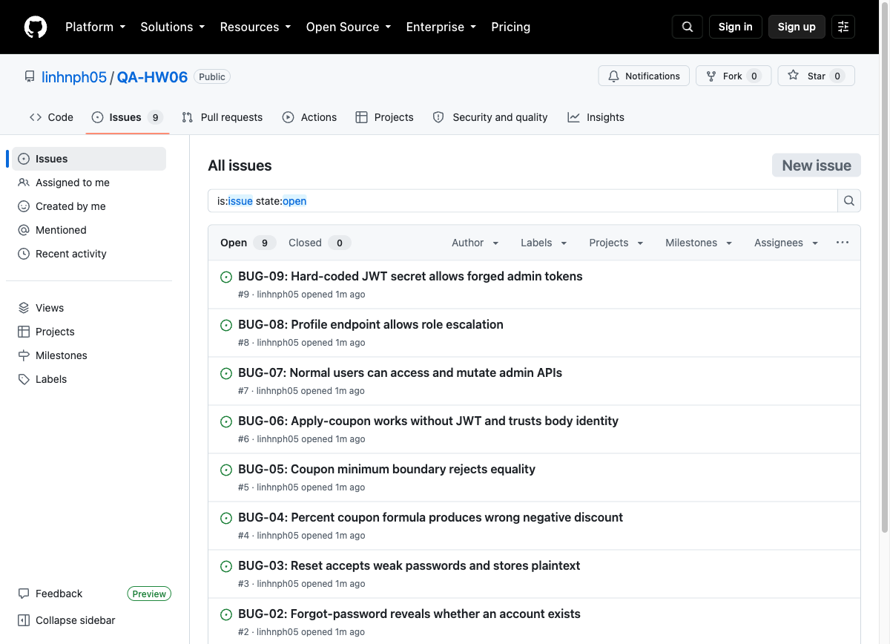
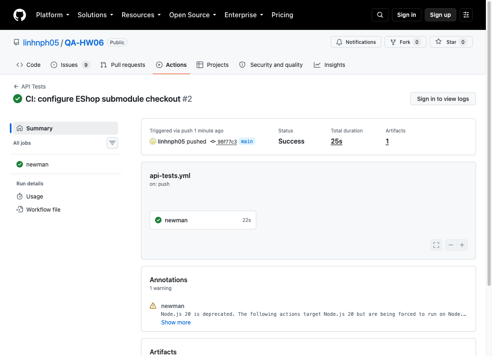
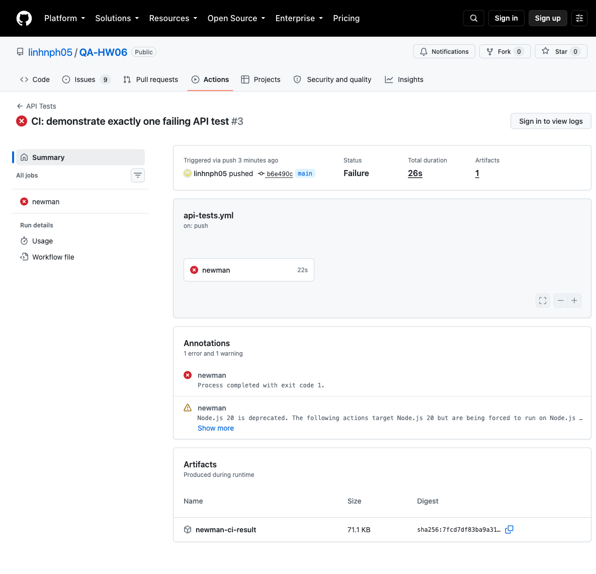
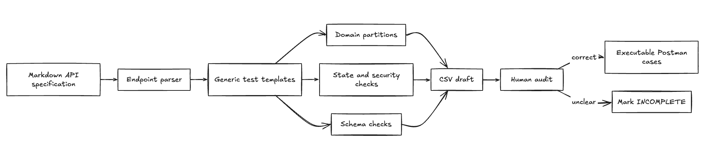

# HW06 - API Testing Report

Student: Nguyễn Phan Hùng Linh  
Student ID: 23127081  
Repository: https://github.com/linhnph05/QA-HW06  
Self-assessed score: **100/100**

## 1. Scope

I tested three EShop features:

| Pool | Feature | Selected endpoints |
|---|---|---|
| A | FR-03 Forgot and reset password | `POST /api/forgot-password`, `POST /api/reset-password` |
| B | FR-09 Discount coupons | `POST /api/apply-coupon`, `POST /api/coupon-usage` |
| C | FR-12 Access control | `GET /api/admin/users`, `DELETE /api/admin/users/:id`,`GET /api/admin/orders`, `PUT /api/admin/orders/:id/status`, `GET /api/coupons`, `POST /api/admin/coupons`, `DELETE /api/admin/coupons/:id`, `POST /api/admin/import-products`, `POST /api/products` |

I used the API specification, security rules SEC-01 to SEC-07, and the running backend at `http://127.0.0.1:3000`.

## 2. AI-First Test Design and Human Audit

I guided three helper AI sessions separately. Each helper received only the relevant feature, endpoints, rules, and required test design areas. Each produced exactly 35 draft cases. I then checked every case against the specification and code.

| Feature | AI cases | Valid | Invalid | Incomplete | Human additions | Final cases |
|---|---:|---:|---:|---:|---:|---:|
| FR-03 | 35 | 30 | 1 | 4 | 5 | 40 |
| FR-09 | 35 | 29 | 1 | 5 | 5 | 40 |
| FR-12 | 35 | 30 | 1 | 4 | 5 | 40 |
| **Total** | **105** | **89** | **3** | **13** | **15** | **120** |

The detailed generation, audit, and extension files are in `test-cases/`. The exact helper prompts and outputs are attached through `AI-AUDIT-REPORT.md`.

The human additions focus on cases that AI often misses: account enumeration, rate limits, concurrent OTP use, coupon usage races, numeric overflow, known-secret JWT forgery, stale roles, deleted users, and admin self-delete.

## 3. Execution

I converted the 120 reviewed cases to one strict Postman collection and ran it with Newman 6.2.2. I also created a separate FR-03 data-driven collection whose request values and expected results come from a CSV file. A collection pre-request script adds `X-Student-Id: 23127081` to every request.

### Commands and Postman steps used

I started the local backend with:

```bash
cd eshop-sut/backend
node server.js
```

Postman desktop did not use a shell command. I used these steps in the application:

1. Click **Import** and import `collections/EShop-HW06.postman_collection.json`.
2. Import `collections/local.postman_environment.json` and select the local environment.
3. Open the collection runner and run the FR-03, FR-09, and FR-12 folders against `http://127.0.0.1:3000`.
4. For the data-driven demonstration, select `EShop-HW06-data-driven.postman_collection.json` and load `data/fr03-runner-data.csv` as the Runner data file.
5. Check the Postman Console to confirm `X-Student-Id: 23127081` on each request.

I ran the strict local suite and exported the JSON and HTML reports with:

```bash
newman run collections/EShop-HW06.postman_collection.json \
  -e collections/local.postman_environment.json \
  -r cli,json,html \
  --reporter-json-export newman/newman-results.json \
  --reporter-html-export newman/newman-report.html
```

I ran the real CSV iteration-data demonstration with:

```bash
newman run collections/EShop-HW06-data-driven.postman_collection.json \
  -e collections/local.postman_environment.json \
  -d data/fr03-runner-data.csv \
  -r cli,json,html \
  --reporter-json-export newman/data-driven-results.json \
  --reporter-html-export newman/data-driven-report.html
```

The data file supplied four iterations. Newman executed four requests and all 16 assertions passed. The collection reads `case_id`, `email`, `expected_status`, and `schema_kind` through `pm.iterationData`.



GitHub Actions ran the passing characterization baseline with:

```bash
newman run collections/EShop-HW06-ci-baseline.postman_collection.json \
  -e collections/local.postman_environment.json \
  -r cli,json \
  --reporter-json-export ci-results/newman-ci.json \
  --color off
```

| Feature | Executed | Passed | Failed | Failed assertions |
|---|---:|---:|---:|---:|
| FR-03 | 40 | 17 | 23 | 25 |
| FR-09 | 40 | 20 | 20 | 26 |
| FR-12 | 40 | 17 | 23 | 23 |
| **Total** | **120** | **54** | **66** | **74** |

There were 389 assertions: 315 passed and 74 failed. The collection-level test script uses `pm.response.to.have.jsonSchema` for every selected test request. Each mapped schema checks the exact allowed keys, required keys, field types, array item types, and `additionalProperties: false`. Error responses must contain only a string `error` field. All schema assertions passed; the remaining failures show security, validation, or business-logic mismatches. Evidence is in `newman/newman-report.html`, `newman/newman-results.json`, `results/*.csv`, `images/newman-summary.png`, and `images/student-id-console.png`. The console screenshot proves that the pre-request script added `X-Student-Id: 23127081` to the executed requests.





## 4. Postman and Newman Features Used

- Collection folders for the three selected features.
- Collection variables and an environment file for the base URL, accounts, tokens, OTPs, IDs, and coupon data.
- A collection-level pre-request script for the student header.
- Request-level test scripts and dynamic state sharing.
- A separate data-driven collection using `pm.iterationData`, the Collection Runner data-file input, and Newman's `-d data/fr03-runner-data.csv` option.
- Positive, negative, boundary, state, and security assertions, plus endpoint-specific exact JSON Schema checks using `pm.response.to.have.jsonSchema`.
- Newman CLI execution with CLI, JSON, and HTML reporters.
- GitHub Actions execution and uploaded JSON result artifact.

## 5. Bugs

I reported nine genuine bugs in both `reports/bug-report.md` and GitHub Issues:

1. Four-digit OTP with no expiry state: https://github.com/linhnph05/QA-HW06/issues/1
2. Forgot-password account enumeration: https://github.com/linhnph05/QA-HW06/issues/2
3. Weak and plaintext reset password: https://github.com/linhnph05/QA-HW06/issues/3
4. Wrong percent coupon formula: https://github.com/linhnph05/QA-HW06/issues/4
5. Wrong minimum-total boundary: https://github.com/linhnph05/QA-HW06/issues/5
6. Coupon API lacks JWT enforcement: https://github.com/linhnph05/QA-HW06/issues/6
7. Admin role is not enforced: https://github.com/linhnph05/QA-HW06/issues/7
8. Profile update allows role escalation: https://github.com/linhnph05/QA-HW06/issues/8
9. Hard-coded JWT secret permits forgery: https://github.com/linhnph05/QA-HW06/issues/9

Every issue includes its own screenshot. The Issues-page evidence is `images/github-issues.png`.



## 6. CI/CD

The workflow in `.github/workflows/api-tests.yml` checks out the SUT submodule, installs Node.js and Newman, starts the backend, runs all 120 baseline cases, and uploads the Newman JSON artifact.

- All-passing commit: `98f77c3aa64d70662ba6aa3b4d4cfad9fed421e8`
- All-passing run: https://github.com/linhnph05/QA-HW06/actions/runs/32109080739
- One-failure commit: `b6e490c6de73f3ae811cb0a0f6e0bab75b7d93ef`
- One-failure run: https://github.com/linhnph05/QA-HW06/actions/runs/32109235988
- Final restored green run: https://github.com/linhnph05/QA-HW06/actions/runs/32109618742

The red sample changes only one expected status from 200 to 418. It produces exactly one failed assertion. I restored it afterward. More detail is in `reports/ci-cd-report.md`.





## 7. AI-Driven Test Generator Skill

I created the reusable `api-test-generator` Agent Skill. It reads Markdown endpoint definitions and writes a CSV test draft. The draft includes domain, boundary, security, header, and schema templates. All generated rows start as `INCOMPLETE` so a human must audit them. The skill validator passed, and the FR-03 demonstration produced `test-cases/fr03-skill-demo.csv`.

I drew the generator diagram using excalidraw. The PNG and pseudocode are in `images/api-test-generator-diagram.png` and `reports/api-test-generator-design.md`.



## 8. AI Critique

The full 200–300 word critique is in `reports/ai-critique.md`. My main lesson is that AI is useful for broad coverage, but a human must challenge its assumptions and connect separate security facts.

## 9. AI Audit Appendix

I use AI tools for the tasks declared in `AI-AUDIT-REPORT.md`. That appendix contains only my interactions with the three helper AIs. It does not include the conversation with the assistant that helped manage this repository.

## 10. Self-Assessment

| No. | Criteria | Grade | Self-Assessed Grade |
|---:|---|---:|---:|
| 1 | FR-03 full pipeline | 30 | 30 |
| 2 | FR-09 full pipeline | 30 | 30 |
| 3 | FR-12 full pipeline | 30 | 30 |
| 4 | Agent Skill | 10 | 10 |
| | **Total** | **100** | **100/100** |
