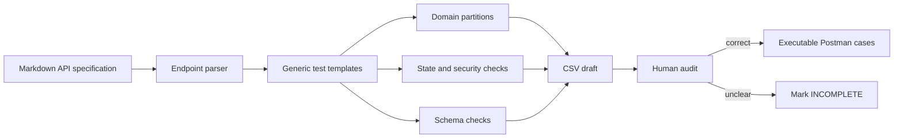

# AI-Driven API Test Generator Design

I designed this generator as a small review pipeline. The program finds endpoints in a Markdown API specification and creates a repeatable CSV draft. It deliberately labels generated cases `INCOMPLETE` because a human must check every expected result against the specification.

## Self-Drawn Diagram



## Pseudocode

```text
read the API specification
find each HTTP method and endpoint
for each selected endpoint
    create a normal positive case
    create missing, empty, wrong-type, and boundary cases
    create authentication, role, injection, and IDOR cases
    create state-transition cases when the feature has state
    create exact response-schema checks
    mark every generated case INCOMPLETE
write the draft to CSV
human checks each case against the specification
human corrects or removes unsupported cases
execute the approved cases with Postman and Newman
```

The main limit is that a Markdown file does not always describe every field constraint or state rule. Therefore, the generator helps with coverage, but it cannot decide undocumented behavior by itself.
