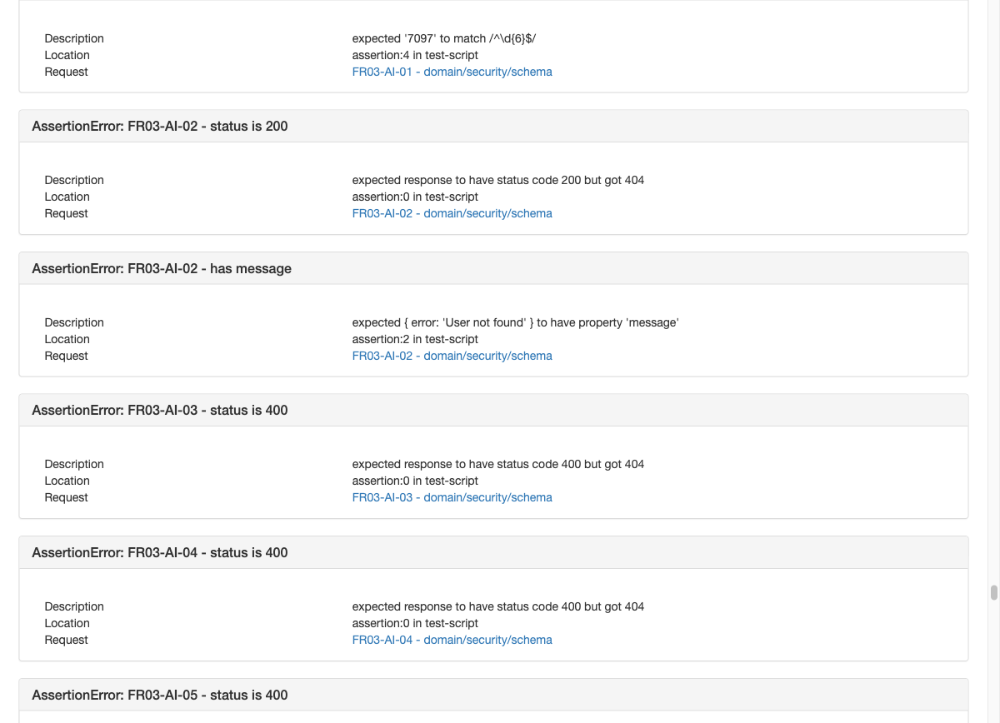
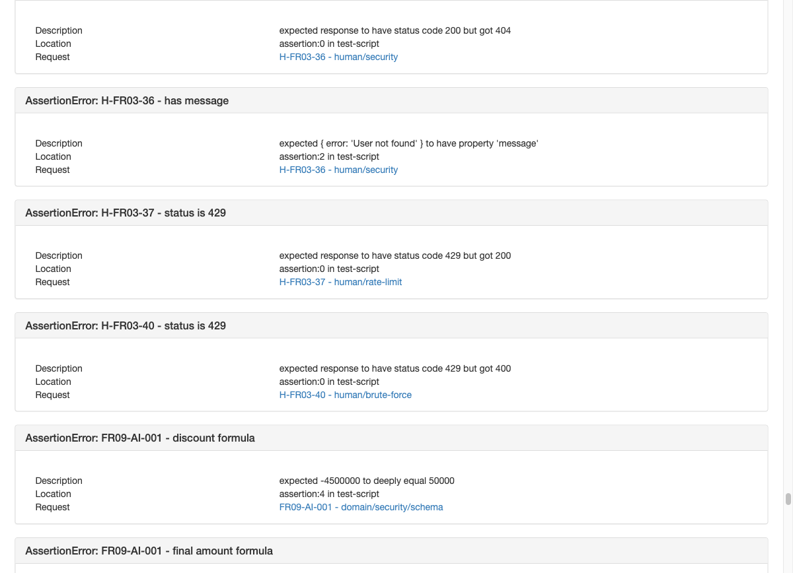
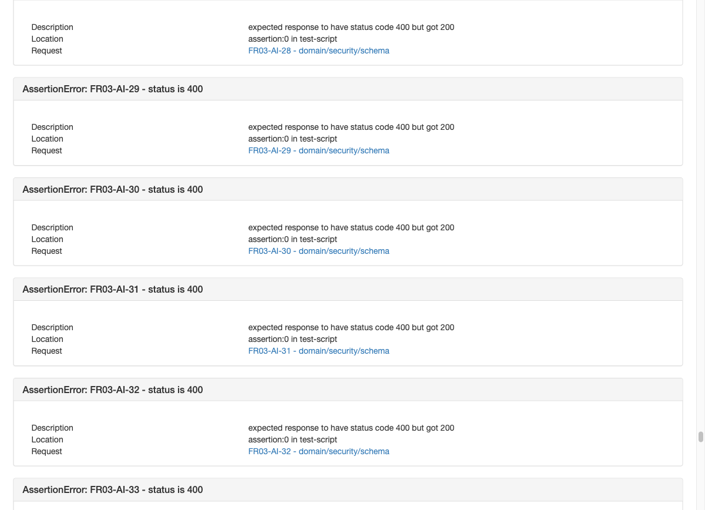
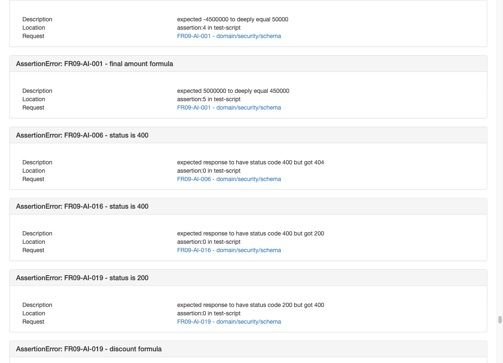
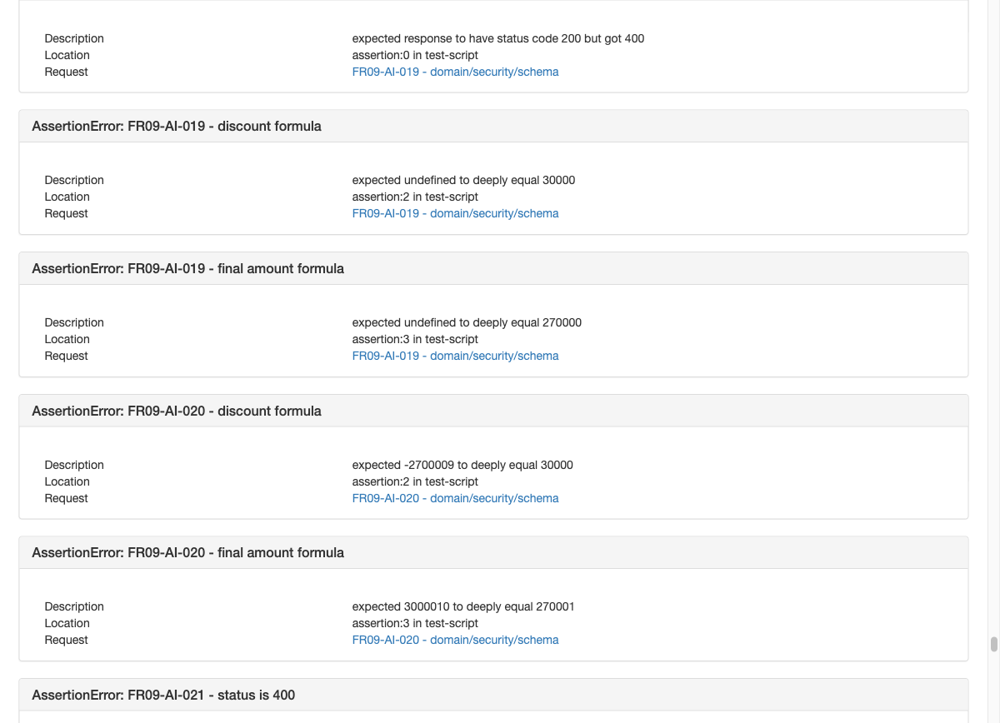
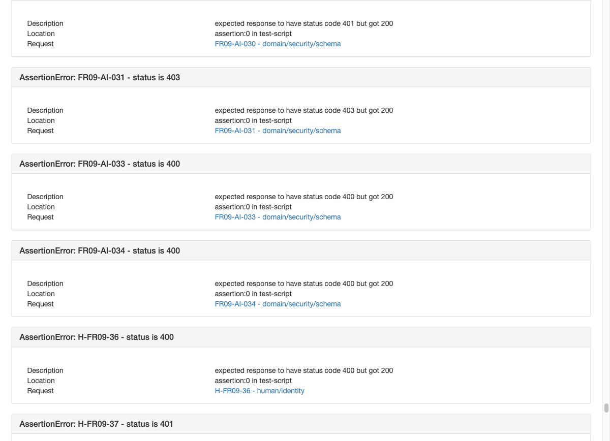
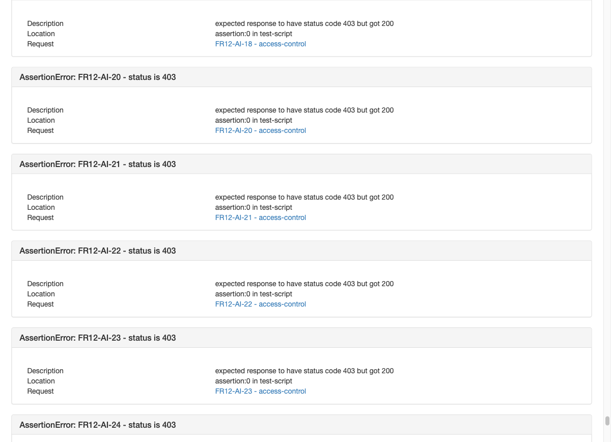
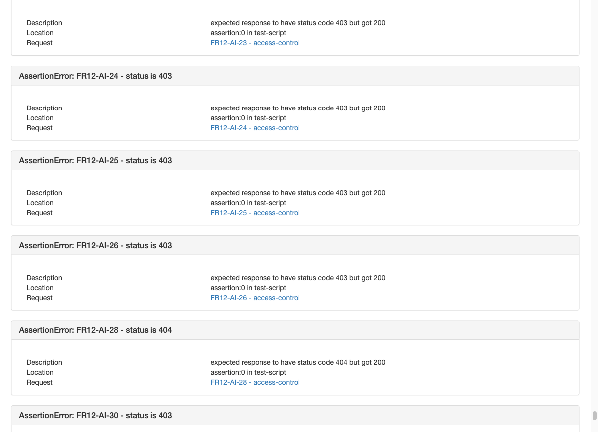
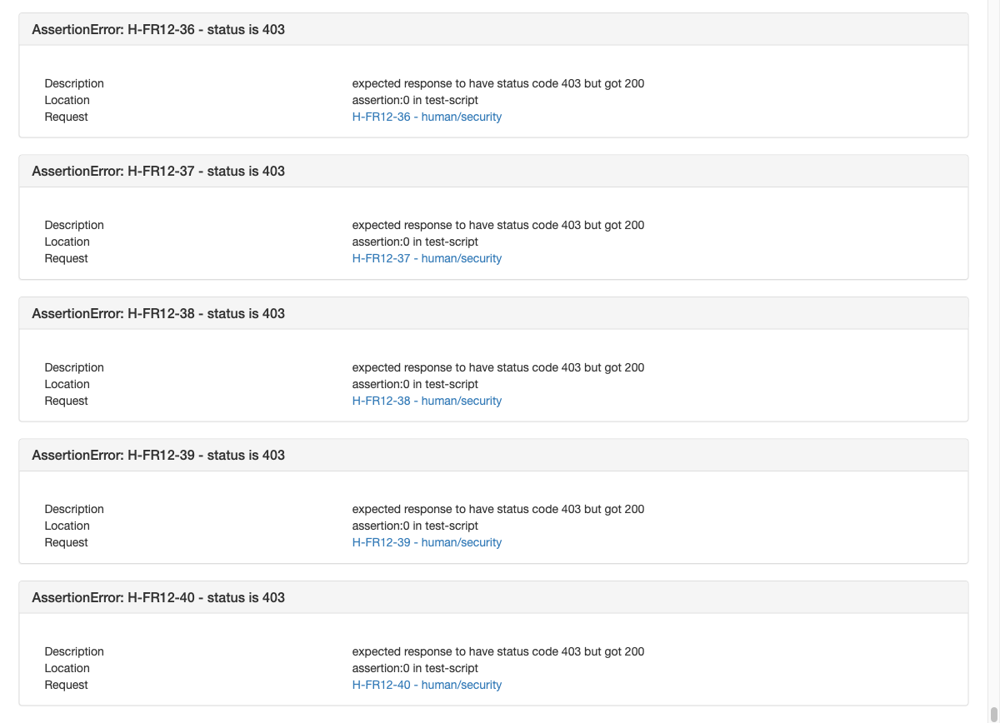

# Bug Report

Environment: EShop backend on `http://127.0.0.1:3000`, tested on 18 August 2026 with Newman 6.2.2. Every automated request used `X-Student-Id: 23127081`.

All nine bugs were also submitted on the public GitHub Issues page.

## BUG-01 - Reset OTP has only four digits and no expiry state

- GitHub Issue: https://github.com/linhnph05/QA-HW06/issues/1

- Severity: High
- Requirement: FR-03 and SEC-07 require at least six digits, an expiry time, and one-time use.
- Steps: Register a user, call `POST /api/forgot-password`, and inspect `resetToken`.
- Expected: Six-digit OTP with stored issue/expiry time.
- Actual: The response contains a four-digit OTP. The database has only `reset_token` and no issue/expiry field.

## BUG-02 - Forgot-password reveals whether an account exists

- GitHub Issue: https://github.com/linhnph05/QA-HW06/issues/2

- Severity: Medium
- Steps: Call forgot-password once with a registered email and once with an unknown email.
- Expected: Both requests return the same generic response.
- Actual: Registered email returns 200 with a token; unknown email returns 404 `User not found`.

## BUG-03 - Reset accepts weak passwords and stores plaintext

- GitHub Issue: https://github.com/linhnph05/QA-HW06/issues/3

- Severity: Critical
- Requirement: FR-01 password complexity and SEC-01 password hashing.
- Steps: Obtain an OTP and reset with a password missing a required character class; then inspect/login.
- Expected: Return 400 and keep the old password. Stored passwords must be one-way hashes.
- Actual: Weak passwords are accepted. The reset SQL writes the submitted password directly.

## BUG-04 - Percent coupon formula produces a large negative discount

- GitHub Issue: https://github.com/linhnph05/QA-HW06/issues/4

- Severity: Critical
- Requirement: `discount = total × discount_value / 100`.
- Steps: Apply `SAVE10` to 500,000 VND.
- Expected: Discount 50,000; final amount 450,000.
- Actual: Discount is -4,500,000 and final amount is 5,000,000 because the code uses `total × (1 - discount_value)`.

## BUG-05 - Coupon minimum boundary incorrectly rejects equality

- GitHub Issue: https://github.com/linhnph05/QA-HW06/issues/5

- Severity: High
- Requirement: FR-09 C3 says total must be greater than or equal to the minimum.
- Steps: Apply `SAVE10` to exactly 300,000 VND.
- Expected: 200 and a valid discount.
- Actual: 400 because the code uses `>` instead of `>=`.

## BUG-06 - Apply-coupon works without JWT and trusts body identity

- GitHub Issue: https://github.com/linhnph05/QA-HW06/issues/6

- Severity: Critical
- Requirement: FR-09 C4 and SEC-02 require a valid JWT.
- Steps: Call `POST /api/apply-coupon` without Authorization. Omit or change `user_id`.
- Expected: 401; usage identity must come from the JWT.
- Actual: 200. Omitting/changing `user_id` also bypasses the correct per-user usage check.

## BUG-07 - Normal users can access and mutate admin APIs

- GitHub Issue: https://github.com/linhnph05/QA-HW06/issues/7

- Severity: Critical
- Requirement: FR-12 and SEC-03 require `role = admin`.
- Steps: Login as the normal seeded user and call `GET /api/admin/users` or an admin mutation.
- Expected: 403 and no data change.
- Actual: 200; the middleware validates only the JWT signature and never checks role.

## BUG-08 - Profile endpoint allows role escalation

- GitHub Issue: https://github.com/linhnph05/QA-HW06/issues/8

- Severity: Critical
- Requirement: FR-04 and SEC-06 forbid client changes to `role`.
- Steps: Login as a normal user and send `PUT /api/users/me` with `"role":"admin"`; login again and access an admin API.
- Expected: Ignore/reject role and keep the user role.
- Actual: The endpoint updates the role from the request body.

## BUG-09 - Hard-coded JWT secret allows forged admin tokens

- GitHub Issue: https://github.com/linhnph05/QA-HW06/issues/9

- Severity: Critical
- Requirement: SEC-02 and SEC-03.
- Steps: Read the public `SECRET_KEY` in `server.js`, sign `{id:1, role:"admin"}`, and call `/api/admin/users`.
- Expected: Attacker-created token is rejected.
- Actual: 200 with the complete user list.

